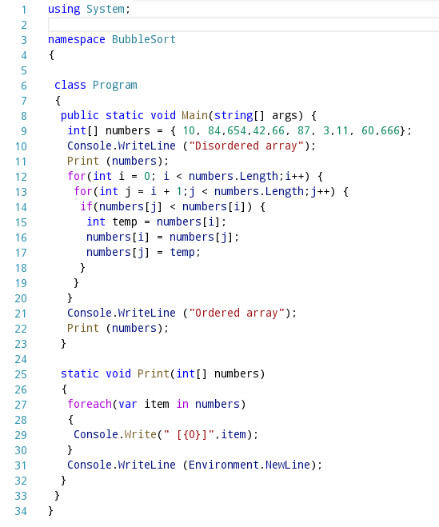
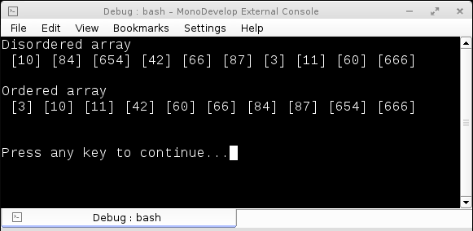

# Entendiendo los arreglos en C#
		

Una de las estructuras de datos básicas en C# son los arreglos, los arreglos son estructuras 
			que contienen elementos del mismo tipo relacionados y de longitud fija. Estas estructuras 
			conservan la misma longitud una vez que se crean; pero esto puede cambiar si a la variable 
			asignada se le asigna un nuevo arreglo con una longitud diferente, a continuación muestro 
			unos ejemplos de como declarar un arreglo:

				<pre>
				  int[] array= new int[6];
				  int[] array2= {0,1,2,3,4,5};
				  var array3 = new int[6]{0,1,2,3,4,5}; 
				</pre>
				
Los elementos de un arreglo pueden ser primitivos, objetos u otros arreglos. Aqui algunos ejemplos: un arreglo con primitivos, objetos y arreglos.

				<pre>
				  string[] array4 = new string[6];
			
						Point[] array5 = new Point[6];
			
						int[][] jaggedArray = {
							new int[] {0,1},
							new int[] {2,3,4},
							new int[] {5,6}
						}; 
				</pre>
				
Para identificar a un elemento dentro de un arreglo se utiliza la posición del elemento 
			dentro del arreglo, a esta posición se le conoce como el <b>índice</b> del elemento. Es importante 
			recordar que para el primer elemento de cualquier arreglo su índice es zero y que el índice 
			siempre es un entero no negativo.

				
Cuando se crea un arreglo y a sus elementos no se les proporciona un valor predeterminado entonces cada elemento se crea con su valor predeterminado: <b>0</b> para los elementos numéricos, <b>false</b> para los <b>boolean</b> y <b>null</b> para las referencias. La longitud de un arreglo se obtiene con la propiedad Length.
			Los elementos de un arreglo pueden recorrerse utilizando una iteración <b>for</b> utilizando un indice o bien con una instrucción <b>foreach</b>, la instrucción <b>foreach</b> itera entre los elementos desde el índice 0 hasta el final del arreglo.
			La instrucción <b>foreach</b> se recomienda para el recorrido de arreglos de solo lectura sin alteración del valor de los elementos, en operaciones donde no se requiere utilizar el indice o bien para los arreglos de tipo objetos.

			
El siguiente programa con el algoritmo Bubblesort muestra con más claridad las propiedades de los arreglos.

			

 
			
Al ejecutar este programa se mostrará el siguiente resultado:

			

